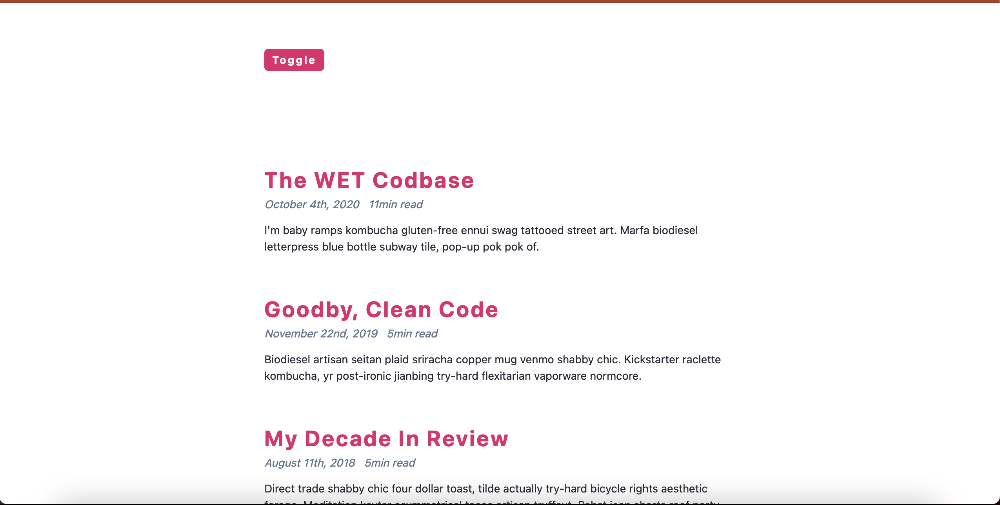
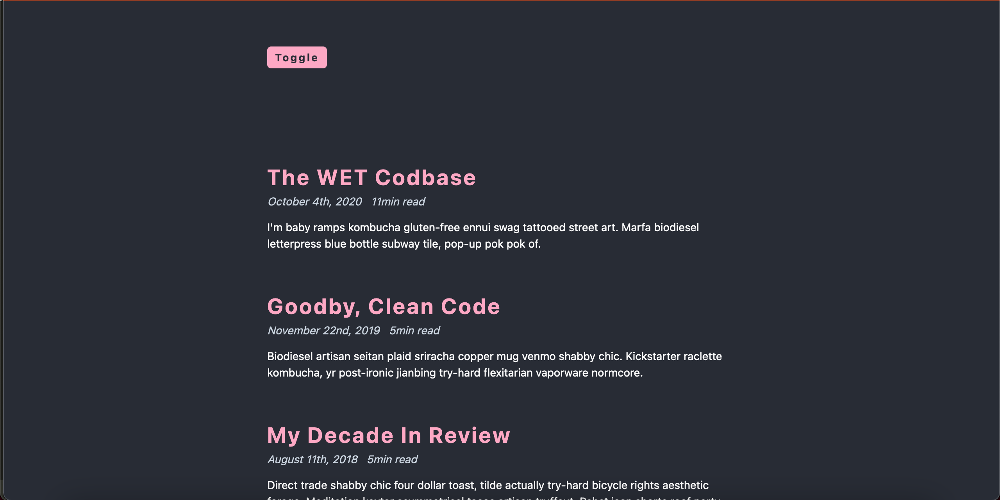

## Dark Mode Results

1. White mode
   

2. Dark Mode
   

## Dark Mode Steps

#### HTML Structure

- main tags
  - nav
    - div.nav-center
      - span 'overreacted'
      - button.btn 'toggle'
  - section.articles
    - article.post
      - h2 'post title'
      - div.post-info
        - span 'date'
        - span 'read time'
      - p 'content'

#### Toggle - JS

- select button
- add click event listener

#### Toggle - CSS

- create .dark-theme class

#### Toggle - JS

- select root element (html), toggle .dark-theme

#### Import Data

#### Display Articles

- select articles
- iterate over, return article.post for each article

#### Format Date

- import moment.js
- format date
